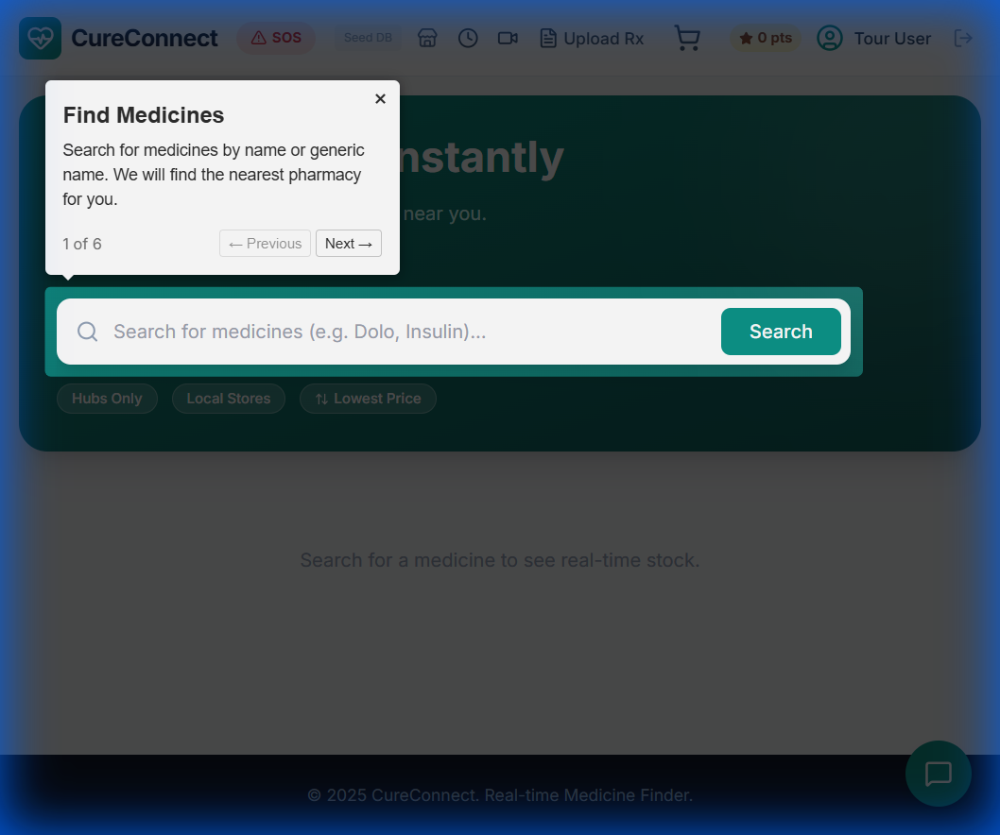
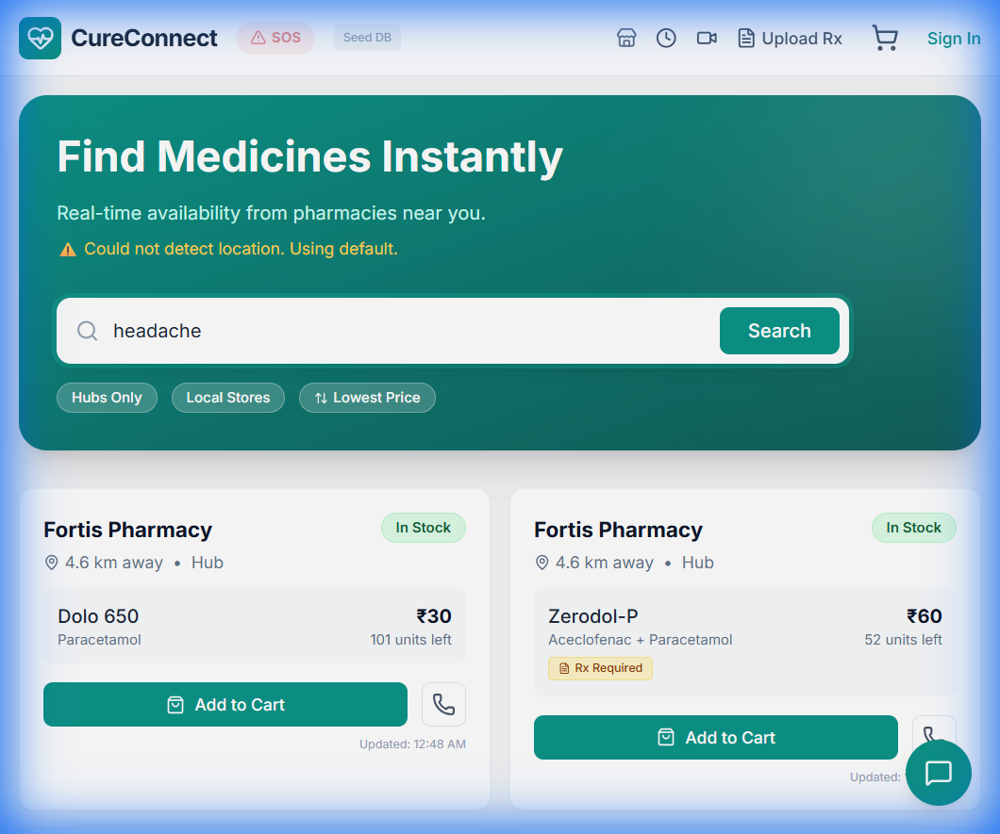
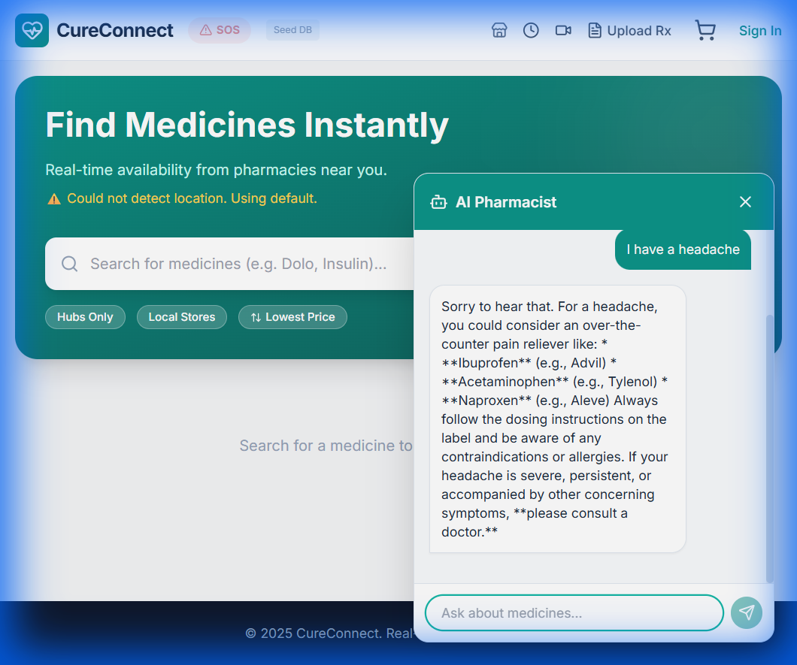
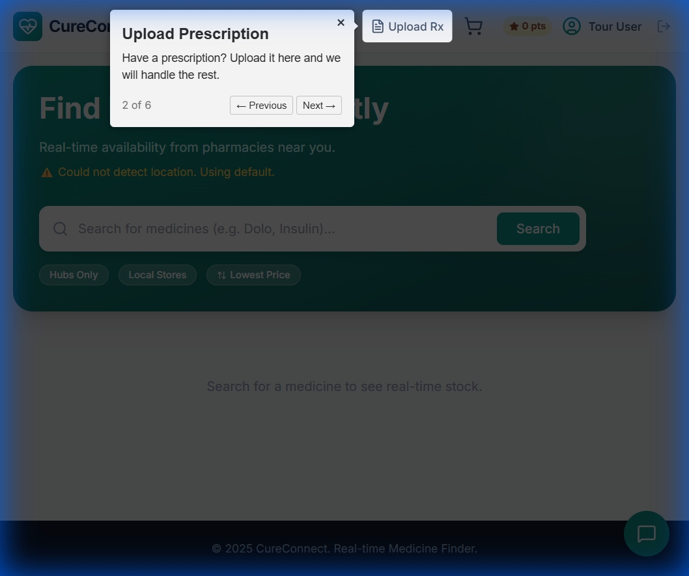
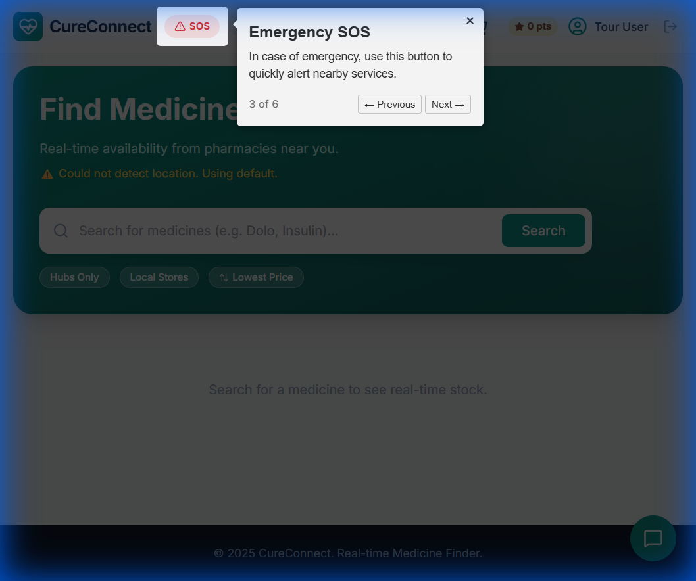

# CureConnect - Real-time Medicine Finder & Healthcare Companion

CureConnect is a comprehensive healthcare platform designed to bridge the gap between patients and pharmacies. It provides real-time medicine availability, AI-powered health assistance, and emergency services, all wrapped in a modern, user-friendly interface.



## 🚀 Key Features

### 1. Real-time Medicine Search
Find medicines instantly across a network of local pharmacies and hubs.
- **Smart Search**: Search by brand name or generic name.
- **AI Interpretation**: Can't remember the exact spelling? Our AI interprets your query (e.g., "headache" -> "Paracetamol").
- **Filters**: Filter by "Hubs Only" or "Local Stores".
- **Price Sort**: Find the most affordable options.



### 2. AI Pharmacist Chatbot
Your 24/7 health assistant powered by Google Gemini.
- **Ask about medicine side effects, dosage, or alternatives.**
- **Get instant, safe, and concise health information.**
- **Context-Aware**: Remembers your conversation history for better assistance.



### 3. Prescription Analysis
Upload your prescription and let AI do the work.
- **Image Recognition**: Automatically extracts medicine names and dosages from prescription images.
- **One-Click Add**: Add extracted medicines directly to your cart.
- **Earn Rewards**: Get points for every valid prescription upload.



### 4. Emergency SOS Mode
Critical support when you need it most.
- **One-Tap Access**: Dedicated SOS button in the header.
- **24/7 Pharmacies**: Instantly find open pharmacies near you.
- **Emergency Contacts**: Quick access to Ambulance (108) and Police (100).



### 5. Smart Reminders & History
Never miss a dose or a refill.
- **Refill Alerts**: Automatic reminders based on your purchase history.
- **Active Courses**: Track your daily medicine intake.

### 6. Teleconsultation
Connect with doctors from home.
- Browse available specialists.
- Book video consultations instantly.

### 7. Partner Dashboard
Empowering pharmacies to manage their business.
- **Inventory Management**: Real-time stock updates.
- **Order Processing**: Manage incoming orders efficiently.

---

## 🛠️ Tech Stack

- **Frontend**: React, TypeScript, Vite, Tailwind CSS
- **Backend/Database**: Firebase (Firestore, Auth)
- **AI Integration**: Google Gemini API (via Google Gen AI SDK)
- **State Management**: React Context API
- **Routing**: React Router DOM
- **Icons**: Lucide React
- **Tours**: Driver.js

---

## � Project Structure

```
cureconnect/
├── src/
│   ├── components/      # Reusable UI components (Header, PharmacyCard, AIChatbot, etc.)
│   ├── pages/           # Main application pages (HomePage, CartPage, etc.)
│   ├── services/        # API and Database services (firebase.ts, geminiService.ts)
│   ├── context/         # Global state management (AppContext.tsx)
│   ├── types/           # TypeScript interfaces and types
│   └── constants.ts     # Mock data and configuration constants
├── dist/                # Production build output
└── public/              # Static assets
```

---

## �📦 Installation & Setup

1.  **Clone the repository**
    ```bash
    git clone https://github.com/yourusername/cureconnect.git
    cd cureconnect
    ```

2.  **Install dependencies**
    ```bash
    npm install
    ```

3.  **Environment Setup**
    Create a `.env` file in the root directory and add your Google Gemini API Key:
    ```env
    GEMINI_API_KEY=your_api_key_here
    ```

4.  **Run Locally**
    ```bash
    npm run dev
    ```
    The app will start at `http://localhost:3000`.

5.  **Build for Production**
    ```bash
    npm run build
    ```
    The output will be in the `dist` folder.

---

## 🧪 Demo Credentials

To test the application, you can use the following demo credentials or create a new account:

**User Account:**
- **Email**: `touruser1@test.com`
- **Password**: `password`

**Partner Account (Pharmacy Owner):**
- **Email**: `partner@apollo.com`
- **Password**: `password`

---

## 🔧 Troubleshooting

- **AI Features Not Working?**
  - Ensure your `GEMINI_API_KEY` is correctly set in the `.env` file.
  - Restart the development server after changing `.env`.

- **Location Not Detected?**
  - Allow browser location permissions when prompted.
  - If denied, the app defaults to a central location in Bangalore for demonstration.

- **Tour Not Showing?**
  - The tour only shows for new users. Create a new account or clear your browser data/Firestore `hasSeenTour` flag to see it again.

---

## 🗺️ Future Roadmap

- [ ] **Mobile App**: Native iOS and Android apps using React Native.
- [ ] **Blockchain Integration**: Secure supply chain tracking for medicines.
- [ ] **Advanced Telemedicine**: Integrated video calling within the platform.
- [ ] **Multi-Language Support**: Localized interface for broader accessibility.

---

## 🔒 Security
- **Role-Based Access**: Secure login for Users and Pharmacy Partners.
- **Data Privacy**: User data and prescriptions are handled securely.

---
---

## 🚀 How to Deploy on Render

Follow these steps to deploy CureConnect for free on Render:

### 1. Push to GitHub
If you haven't already, push your code to a GitHub repository.

### 2. Create a Static Site on Render
1.  Go to [Render Dashboard](https://dashboard.render.com/).
2.  Click **New +** and select **Static Site**.
3.  Connect your GitHub repository.

### 3. Configure Build Settings
During the setup, use the following configurations:
- **Build Command**: `npm install && npm run build`
- **Publish Directory**: `dist`

### 4. Advanced: Environment Variables (Optional)
If you move your API keys to environment variables later, you can add them in the **Environment** tab on Render:
- `VITE_MYUPCHAR_API_KEY`: Your myUpchar API Key.

### 5. Finalize
Click **Create Static Site**. Render will now build and deploy your application. Once finished, you'll receive a live URL.

---

## 🔥 How to Deploy on Firebase Hosting

Since you've already connected the database, you can also host your website on Firebase for free:

### 1. Install Firebase Tools
If you haven't yet, run this in your terminal:
```bash
npm install -g firebase-tools
```

### 2. Login and Initialize
1.  **Login**: Run `firebase login` and follow the browser prompts.
2.  **Verify**: I have already created `firebase.json` and `.firebaserc` for you! You don't need to run `firebase init` if you use my files.

### 3. Build & Deploy
Run these commands to go live:
```bash
npm run build
firebase deploy
```

Your site will be live at `https://cureconnect-95fb6.web.app`!

---
© 2025 CureConnect. All rights reserved.
